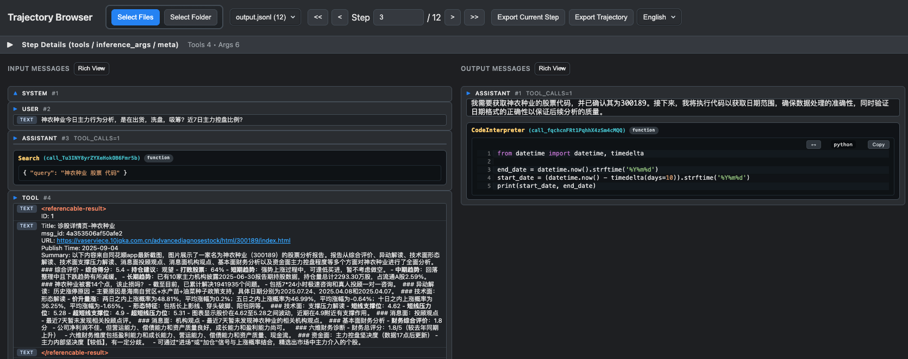

# Trajectory Browser

     

> 🚀 Trajectory Browser: Visualizing and navigating agent rollout trajectory files seamlessly.

> 🚀 轨迹浏览器：浏览 agent rollout 轨迹文件

⭐ 如果这个项目对您有帮助，请给它一个星星！



## 📖 项目简介

Trajectory Browser 是一个简洁高效的在线工具，专为可视化和浏览 RL/AI agent rollout 轨迹（JSON/JSONL 文件）而设计。用户可通过拖拽或选择本地文件，快速查看、分析和导出轨迹数据，极大提升数据理解与调试效率。

## ✨ 主要特性

- 🗂️ **多文件支持**：支持批量拖拽或选择多个 JSONL 轨迹文件，自动过滤无效文件。
- 🔍 **步骤详情浏览**：分步查看每个 step 的输入、输出、工具调用、推理参数、元信息等，结构化展示。
- 🧩 **美化视图与 JSON 切换**：支持美化视图、原始 JSON、编辑模式自由切换，便于数据理解与修改。
- 📝 **内置编辑与对比**：可直接编辑 step 内容，支持与原始数据对比，便捷追踪修改。
- 📤 **导出功能**：支持导出当前 step 或完整轨迹为 JSON 文件。
- 🔦 **高亮与搜索**：支持高亮答案、结构展开、内容搜索、关键字段标记。
- 🧭 **多语言界面**：自动适配中英文界面。
- 💡 **响应式设计**：适配桌面与移动端，界面美观现代。

## 🛠️ 技术栈

- **前端**：原生 HTML/CSS/JavaScript
- **样式**：自定义 CSS，深色主题，响应式布局
- **无依赖**：无需安装任何依赖，开箱即用

## 🚀 快速开始

### 在线使用

直接用浏览器打开 `index.html` 文件即可，无需后端。

### 本地运行

1. 克隆项目到本地：
	```bash
	git clone https://github.com/LinXueyuanStdio/trajv.git
	cd trajv
	```
2. 用浏览器打开 `index.html`，或使用本地服务器：
	```bash
	# Python 3
	python -m http.server 8000
	# Node.js
	npx http-server
	```
3. 访问 `http://localhost:8000`

## 📝 使用说明

1. **载入轨迹文件**：
	- 拖拽 JSONL 文件到页面指定区域，或点击按钮选择文件。
	- 支持批量选择，自动跳过非 JSONL 文件。
2. **浏览与分析**：
	- 左侧选择不同 step，右侧查看详细内容（输入、输出、工具、参数、meta 等）。
	- 支持美化视图、JSON、编辑三种模式切换。
	- 可高亮答案、展开结构、搜索内容。
3. **编辑与导出**：
	- 可直接编辑 step 内容，支持格式化与恢复原始。
	- 支持导出当前 step 或完整轨迹为 JSON 文件。

## 🎯 支持的数据格式

- **JSONL**：每行一个 JSON 对象，常用于 RL/AI 轨迹。
- **JSON**：支持部分 JSON 文件（需为数组或对象）。

## 🔧 高级功能

- **结构化详情面板**：分区展示 tools、inference_args、meta 等关键字段。
- **多步跳转与搜索**：快速定位目标 step，支持内容搜索与跳转。
- **自适应换行与横向滚动**：大数据结构浏览更友好。
- **全屏与还原**：编辑器支持全屏、还原视图。

## 🤝 贡献指南

欢迎提交 Issue 和 Pull Request！

1. Fork 本项目
2. 创建您的特性分支 (`git checkout -b feature/AmazingFeature`)
3. 提交您的更改 (`git commit -m 'Add some AmazingFeature'`)
4. 推送到分支 (`git push origin feature/AmazingFeature`)
5. 打开一个 Pull Request

## 📜 许可证

本项目采用 MIT 许可证 - 查看 [LICENSE](LICENSE) 文件了解详情。

## 📞 联系方式

如有问题或建议，请通过以下方式联系：


## JSONL Viewer VS Code 扩展

本仓库已添加一个 VS Code 扩展，可用自定义只读编辑器打开以 `.jsonl` 为后缀的文件，并使用仓库根目录的 `index.html` 作为 Webview UI 模板进行展示。

### 主要特性
- 通过自定义编辑器自动接管 `*.jsonl` 文件，优先级为 default。
- 扩展会读取 `.jsonl` 文件内容并通过 Webview 渲染。页面中会在 `#jsonl-root` 容器内以逐行的方式显示内容（带行号）。
- 自动注入 CSP 与脚本，确保在 Webview 环境下安全运行。

### 开发与调试
1. 安装依赖并编译：
	- 在 VS Code 运行“任务: 运行任务”或使用调试配置会自动执行 `npm run compile`。
2. 启动扩展宿主：
	- 在“运行和调试”面板选择“Run Extension”，会打开新的 Extension Development Host。
3. 打开任意 `.jsonl` 文件，即会以“JSONL Viewer (TrajV)”打开。

### 打包
可使用 `vsce` 打包扩展：
```
npm run package
```

### 注意
- 该编辑器为只读显示，不会修改 `.jsonl` 文件内容。
- Webview 将尝试重写 `index.html` 中的本地资源链接到 Webview 可访问的 `vscode-resource` 形式，若资源路径异常，请检查资源是否存在于工作区内。
- 未打开工作区时也可直接打开单个 `.jsonl` 文件：扩展会优先在该文件所在目录查找 `index.html`，找不到则使用内置模板（`media/template-index.html`）。
⭐ 如果这个项目对您有帮助，请给它一个星星！
